# Instalacion dokker en alpine

- Entras en la pagina oficial de Alpine Linux.
- Te diriges al apartado de descargas.
- Arriba de la pagina en el que pone standard eliges la opccion de x86_64.
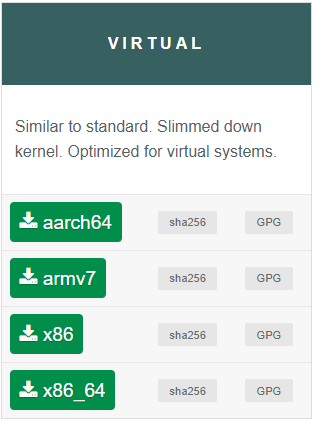

- Creamos una maquina virtual

- La llamaremos alpine.
- Le indicaremos que sera de tipo linux.
- En version seleccionaremos other linux porque no estaalpine como opcion.
- Dejamos todas las opciones como estan(Las remendadas).
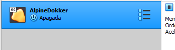
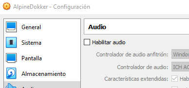

- Deshabilitamos el sonido.
- Iniciamos la maquina virtual de alpine.
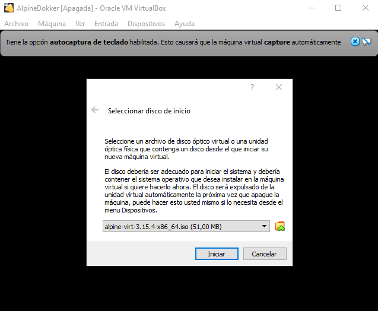

- Seleccionamos el alpine virtual que hemos descargado
- Iniciamos.
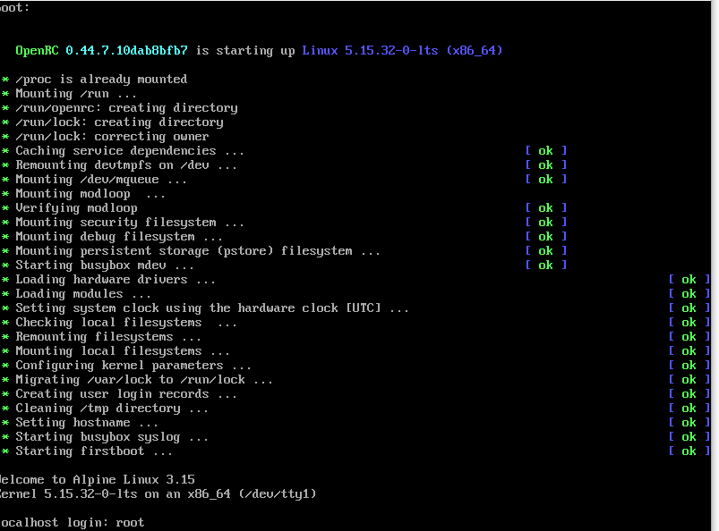

- Nos pedira usuario la loguearnos.
- Nos logueamos como root.
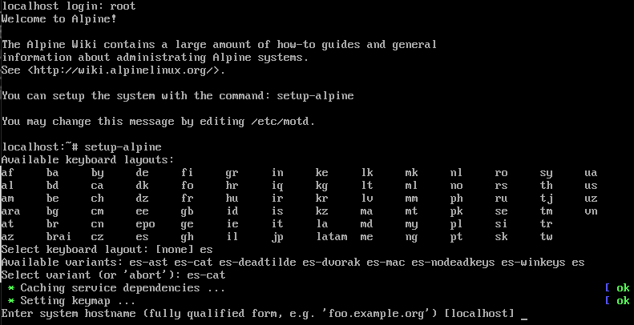

- Ejecutamos el comando setup-alpine.
- Seleccionamos la distribucion del teclado "es" y luego "es_cat" 
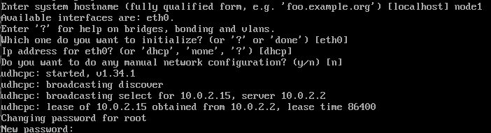

- Entramos como node1.
- Pulsamos enter hasta que nos pina nueva contraseña.
- Ponemos contraseña.
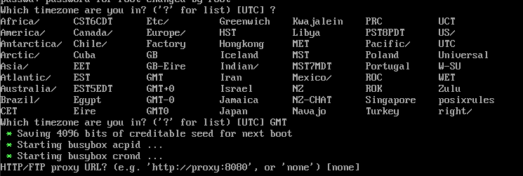

- Le ponemos zona horaria GTM que es la española.
- Pulsamos enter para dejar ajustes por defecto.
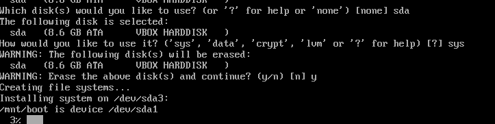

- Cuando nos pida disco le decimos que quermos usar el sda.
- Cuando te pida el tipo indicas sys.
- Pones y para confirmar.
- Una vez descargado apagamos la maquina.
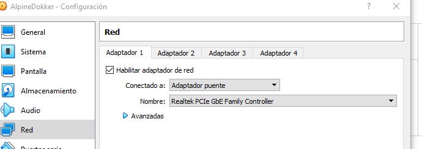
- Cambiamos la red a adaptador puente para tener red en la maquina.
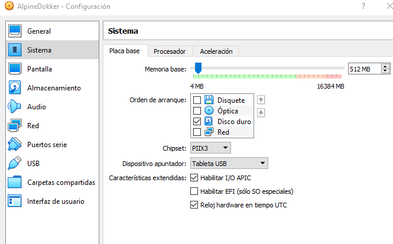

- En configuracion vamos a sistema y en orden de arranque, desseleccionamos optica y disquete, que solo quede seleccionado Disco duro.
- Arrancamos la maquina otra vez.
- Ejecutamos el comando "vi /etc/ssh/sshd_config".
- Nos situamos en la linea 23 que la modificamos a yes.
- Restablecemos el sshd y pedimos la ip.
- Ejecutamos "vi /etc/apk/repositories" y borramos todos los hastags.
- Finalmente ejecutamos "apk add docker" y se descargará.
 

