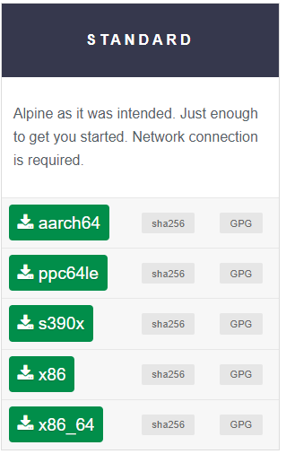

# Instalacion dokker en alpine

- Entras en la pagina oficial de Alpine Linux.
- Te diriges al apartado de descargas.
- Arriba de la pagina en el que pone standard eliges la opccion de x86_64.

- Creamos una maquina virtual

- La llamaremos alpine.
- Le indicaremos que sera de tipo linux.
- En version seleccionaremos other linux porque no estaalpine como opcion.
- Dejamos todas las opciones como estan(Las remendadas).

- Deshabilitamos el sonido.
- Iniciamos la maquina virtual de alpine.

- Seleccionamos el alpine virtual que hemos descargado
- Iniciamos.

- Nos pedira usuario la loguearnos.
- Nos logueamos como root.

- Ejecutamos el comando setup-alpine
- Seleccionamos la distribucion del teclado "es" y luego "es_cat" 

